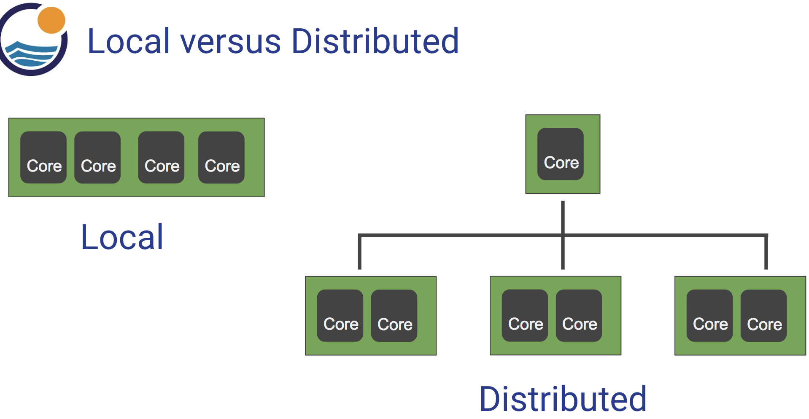
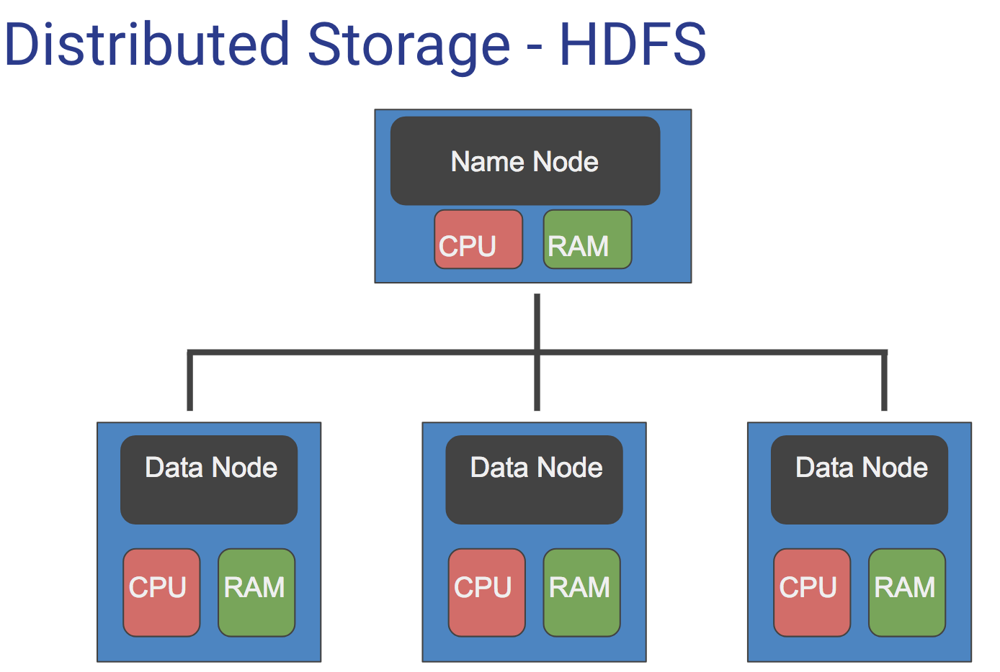
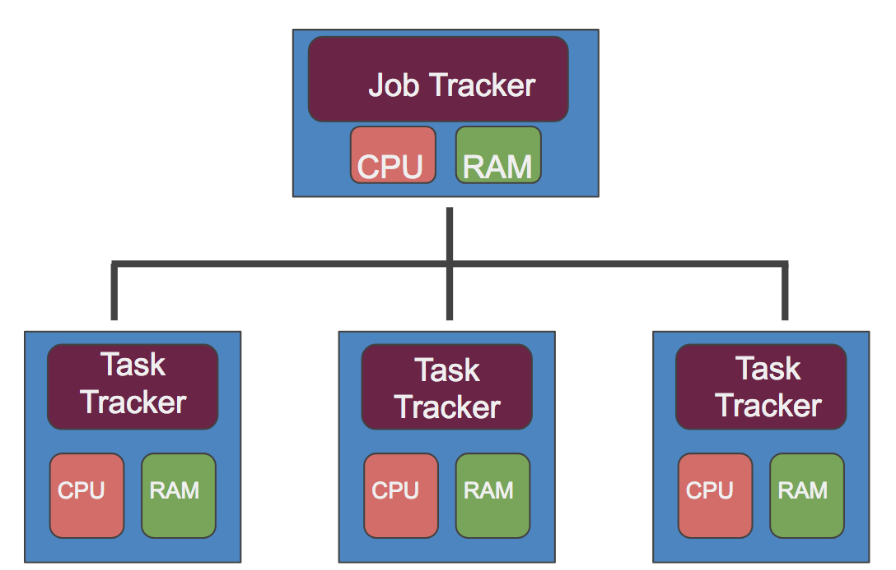
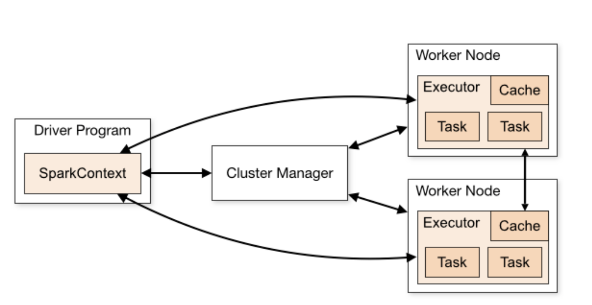
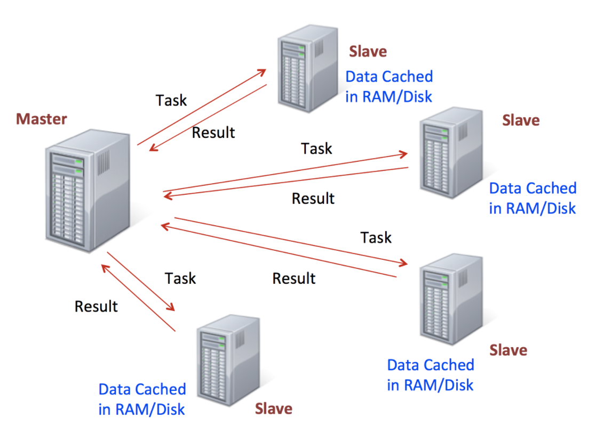

## ***Spark overview***

### Big Data Overview

- What is “Big Data”?
- Explanation of Hadoop, MapReduce,and Spark
- Local versus Distributed Systems
- Overview of Hadoop Ecosystem
- Overview of Spark

### Big Data

- Data that can fit on a local computer, in the scale of 0-32 GB depending on RAM.
- But what can we do if we have a larger set of data?
    - Try using a SQL database to move storage onto hard drive instead of RAM
    - Or use a distributed system, that distributes the data to multiple machines/computer.

- A local process will use the computation resources of a single machine
- A distributed process has access to the computational resources across a number of machines connected through a network
- After a certain point, it is easier to scale out to many lower CPU machines, than to try to scale up to a single machine with a high CPU.
- Distributed machines also have the advantage of easily scaling, you can just add more machines

### Hadoop
- Hadoop is a way to distribute very large files across multiple machines.
- It uses the Hadoop Distributed File System (HDFS)
- HDFS allows a user to work with large data sets
- HDFS also duplicates blocks of data for fault tolerance
- It also then uses MapReduce
- MapReduce allows computations on that data

### Distributed Storage - HDFS

- HDFS will use blocks of data, with a size of 128 MB by default
- Each of these blocks is replicated 3 times
- The blocks are distributed in a way to support fault tolerance
- Smaller blocks provide more parallelization during processing
- Multiple copies of a block prevent loss of data due to a failure of a node

### MapReduce

- MapReduce is a way of splitting a computation task to a distributed set of files (such as HDFS)
- It consists of a Job Tracker and multiple Task Trackers
- The Job Tracker sends code to run on the Task Trackers
- The Task trackers allocate CPU and memory for the tasks and monitor the tasks on the worker nodes

***What we covered can be thought of in two distinct parts:*** 
- Using HDFS to distribute large data sets
- Using MapReduce to distribute a computational task to a distributed data set

### Spark RDDs

- At the core of Spark is the idea of a Resilient Distributed Dataset (RDD)
- Resilient Distributed Dataset (RDD) has 4 main features:
    - Distributed Collection of Data
    - Fault-tolerant
    - Parallel operation - partioned
    - Ability to use many data sources

- RDDs are immutable, lazily evaluated, and cacheable
- There are two types of Spark operations:
    - Transformations
    - Actions
- Transformations are basically a recipe to follow.
- Actions actually perform what the recipe says to do and returns something back

- This behaviour carries over to the syntax when coding.
- A lot of times you will write a method call, but won’t see anything as a result until you call the action.
- This makes sense because with a large dataset, you don’t want to calculate all the transformations until you are sure you want to perform them!

