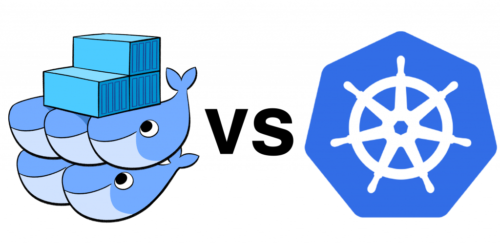
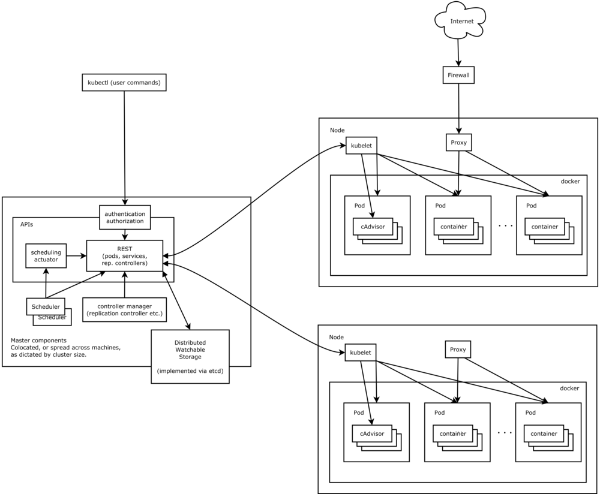

# overview



* [GCE 搭建环境](https://blog.gcp.expert/gke-k8s-pod-network/)
* [Microservices](https://martinfowler.com/articles/microservices.html)
* [十分钟带你理解Kubernetes核心概念](http://dockone.io/article/932)  

Kubernetes 是自动化容器操作的开源平台，这些操作包括部署，调度和节点集群间扩展。如果你曾经用过Docker容器技术部署容器，那么可以将Docker看成Kubernetes内部使用的低级别组件。Kubernetes不仅仅支持Docker，还支持Rocket，这是另一种容器技术。 使用Kubernetes可以：

> 自动化容器的部署和复制  
> 随时扩展或收缩容器规模  
> 将容器组织成组，并且提供容器间的负载均衡  
> 很容易地升级应用程序容器的新版本  
> 提供容器弹性，如果容器失效就替换它

Kubernets 的特性有:

* 每個Service包含著一個以上的pod
* 每個Service有個獨立且固定的IP地址 – Cluster IP
* 客戶端訪問Service時，會經由上述提過的proxy來達到負載平衡、與各pod連結的結果
* 利用標籤選擇器\(Label Selector\)，聰明地選擇那些已貼上標籤的pod

实际上，使用Kubernetes只需一个部署文件，使用一条命令就可以部署多层容器（前端，后台等）的完整集群：

`kubectl create -f single-config-file.yaml`

kubectl是和Kubernetes API交互的命令行程序。现在介绍一些核心概念.

分布式系統，主要元件有：

* Master – 大總管，可做為主節點
* Node – 主要工作的節點，上面運行了許多容器。可想作一台虛擬機。K8S可操控高達1,000個nodes以上
* masters和nodes組成叢集\(Clusters\),如图:


Master 包含了三個基本組件 _**Etcd, API Server, Controller Manager Server**_

Node 包含了四個基本組件 _**Kubelet, Proxy, Pod, Container**_

現在我們著重在K8S最重要的三個部分，即是 • Pod • Service • Deployments \(Replication Controller\)\


### - _**Pod**_

容器是位於pod內部，一個pod包覆著一個以上的容器，這造成K8S與一般容器不同的操作概念。在Docker裡，Docker container是最小單位，但在K8S可想作pod為最小單位  
Pod安排在节点上，包含一组容器和卷。同一个Pod里的容器共享同一个网络命名空间，可以使用localhost互相通信。pod 由一个或者多个容器组成，一般运行着相同的应用。一个 pod 中的所有容器都必须运行在同一台机器上共享网络空间（network namespace）和存储 （volume\)  
Pod是短暂的，不是持续性实体你可能会有这些问题:

* 如果Pod是短暂的，那么我怎么才能持久化容器数据使其能够跨重启而存在呢？ 是的，Kubernetes支持卷的概念，因此可以使用持久化的卷类型  
* 是否手动创建Pod，如果想要创建同一个容器的多份拷贝，需要一个个分别创建出来么？可以手动创建单个Pod，但是也可以使用Replication Controller使用Pod模板创建出多份拷贝，下文会详细介绍  
* 如果Pod是短暂的，那么重启时IP地址可能会改变，那么怎么才能从前端容器正确可靠地指向后台容器呢？这时可以使用Service，下文会详细介绍
* Pod 擁有不確定的生命週期，這意味著您不曉得任一pod是否會永久保留
* Pod 內有一個讓所有container共用的Volume，這會與Docker不同  
* Pod 採取shared IP，內部所有的容器皆使用同一個Pod IP，這也與Docker不同  
* Pod 內的眾多容器都會和Pod同生共死，就像桃園三結義一樣！  

### - _**Lable**_

正如图所示，一些Pod有Label。一个Label是attach到Pod的一对键/值对，用来传递用户定义的属性。比如，你可能创建了一个"tier"和“app”标签，通过Label（tier=frontend, app=myapp）来标记前端Pod容器，使用Label（tier=backend, app=myapp）标记后台Pod。然后可以使用Selectors选择带有特定Label的Pod，并且将Service或者Replication Controller应用到上面。

### - _**Service**_

K8S的 Service 有它的獨特方法，我們看看它的特性

* 每個Service包含著一個以上的pod
* 每個Service有個獨立且固定的IP地址 – Cluster IP
* 客戶端訪問Service時，會經由上述提過的proxy來達到負載平衡、與各pod連結的結果
* 利用標籤選擇器\(Label Selector\)，聰明地選擇那些已貼上標籤的pod

### - _**Deployments**_

舊版的K8S使用了副本控制器\(Replication Controller\)的名詞，在新版已經改成 Deployments Deployments顧名思義掌控了部署Kubernetes服務的一切它主要掌管了Replica Set的個數，而Replica Set的組成就是一個以上的Pod

* Deployments 的設定檔\(底下以YAML格式為例\)，可以指定replica，並保證在該replica的數量運作
* Deployments 會檢查pod的狀態
* Deployments 下可執行滾動更新或者回滾

## - _**kubernetes 组件**_

kubernetes 整体上的框架是下面这样的，由多个不同的部分组成，下面将逐个讲解这些部分的功能



### _**kubectl**_

这是 kubernetes 提供的客户端程序，也是目前常用的和集群交互的方式。创建、查看、管理、删除、更新 pod、service、replication controller，还有更多其他命令

### _**etcd 集群**_

etcd 是 kubernetes 存放集群状态和配置的地方，这是集群状态同步的关键，所有节点都是从 etcd 中获取集群中其他机器状态的；集群中所有容器的状态也是放在这里的。

kubernetes 在 etcd 中存储的数据在 /registry 路径下，结构类似下面这样：

```text
  /registry/minions
  /registry/namespaces
  /registry/pods
  /registry/ranges
  /registry/serviceaccounts
  /registry/services
  /registry/controllers
  /registry/events
```

### _**Master 组件**_

kubernetes 是典型的 master-slave 模式，master 是整个集群的大脑，负责控制集群的方方面面。

### _**API server**_

对外提供 kubernetes API，也就是 kubernetes 对外的统一入口。封装了 kubernetes 所有的逻辑，通过 RESTful 的方式供客户端使用，kubectl 就是最常用到的客户端程序。

### _**Scheduler**_

调度器：实现容器调度的组件，调度算法可以由用户自己实现。Scheduler 会收集并分析当前系统中所有 slave 节点的负载情况，在调度的时候作为决策的重要依据。

调度器监听 etcd 中 pods 目录的变化，当发现新的 pod 时，会利用调度算法把 pod 放到某个节点进行部署。可能的 scheduler 包括：

> random：随机调度算法  
> round robin：轮询调度

### _**Controller Manager Server**_

集群中其他功能都是在 controller manager 中实现的，每个部分负责一个独立功能的管理。例如：

```text
endpoints controller
node controller
replication controller
service controller
```

### _**slave 组件**_

_**kubelet**_  
kubelet 是 slave 上核心的工作进程，负责容器和 pod 的实际管理工作（创建、删除等）以及和 master 通信，内容包括：

负责容器的创建、停止、删除等具体工作，也包括镜像下载、 volume 管理 从 etcd 中获取分配给自己的信息，根据其中的信息来控制容器以达到对应的目标状态 接受来自 master 的请求，汇报本节点的信息

_**kube-proxy**_  
正如名字提示的一样，kube-proxy 为 pod 提供代理服务，用来实现 kubernetes 的 service 机制。每个 service 都会被分配一个虚拟 ip，当应用访问到 service ip 和端口的时候，会先发送到 kube-proxy，然后才转发到机器上的容器服务。

