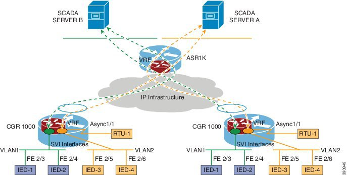

### VPN Routing and Forwarding (VRF)-Lite Software Configuration Guide for Cisco CGR1000 (Cisco IOS)

[ 原文链接 ](https://www.cisco.com/c/en/us/td/docs/routers/connectedgrid/cgr1000/ios/software/15_4_1_cg/vrf_cgr1000.html#pgfId-1180836)

> Virtual Private Networks (VPNs) provide a secure way for customers to share bandwidth over an ISP backbone network. A VPN is a collection of sites sharing a common routing table. A customer site is connected to the service provider network by one or more interfaces, and the service provider associates each interface with a VPN routing table. A VPN routing table is called a VPN routing/forwarding (VRF) table.

#### Information About VRF-lite
VRF-lite provides traffic isolation by using input interfaces to distinguish routes for different VLANs and forms virtual packet-forwarding tables by associating one or more Layer 3 interfaces with each VRF. Interfaces in a VRF can be either physical, such as Ethernet ports, or logical, such as VLAN SVIs and loopback interfaces, but a Layer 3 interface cannot belong to more than one VRF at any time.

> Note	VRF-lite interfaces must be Layer 3 interfaces

Figure 1 shows an example of a VRF-lite implementation for the CGR 1000.



In Figure 1, two CGR 1000 routers are connected to the head-end router in a FlexVPN hub-and-spoke configuration. VRF Green is mapped to VLAN1, and VRF Orange is mapped to VLAN2. Each router has a serial interface, associated with a local IP address, to transport raw socket traffic from Remote Terminal Units (RTUs). Ethernet ports in VLAN2 and the loopback interface used by raw socket on each CGR 1000 are configured in VRF Orange so that traffic from those interfaces can be isolated and routed to SCADA Server A according to the FlexVPN tunnel configuration.

For more information about FlexVPN, see [FlexVPN Software Configuration Guide for Cisco 1000 Series Connected Grid Routers (Cisco IOS)](https://www.cisco.com/c/en/us/support/routers/1000-series-connected-grid-routers/products-installation-and-configuration-guides-list.html)


### CMD guide

```shell
# ssh to set-uped cgr1000
ssh cg-nms-administarator@192.168.151.50


```