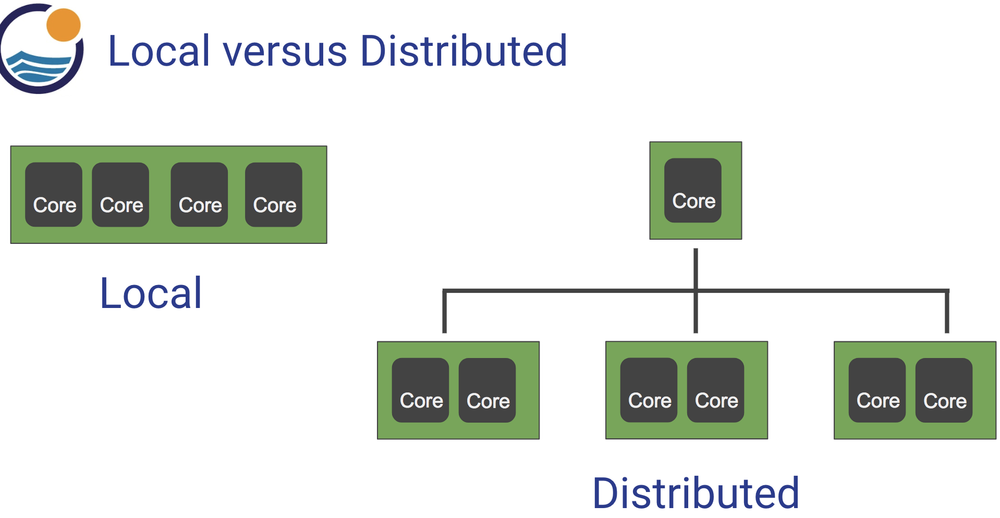
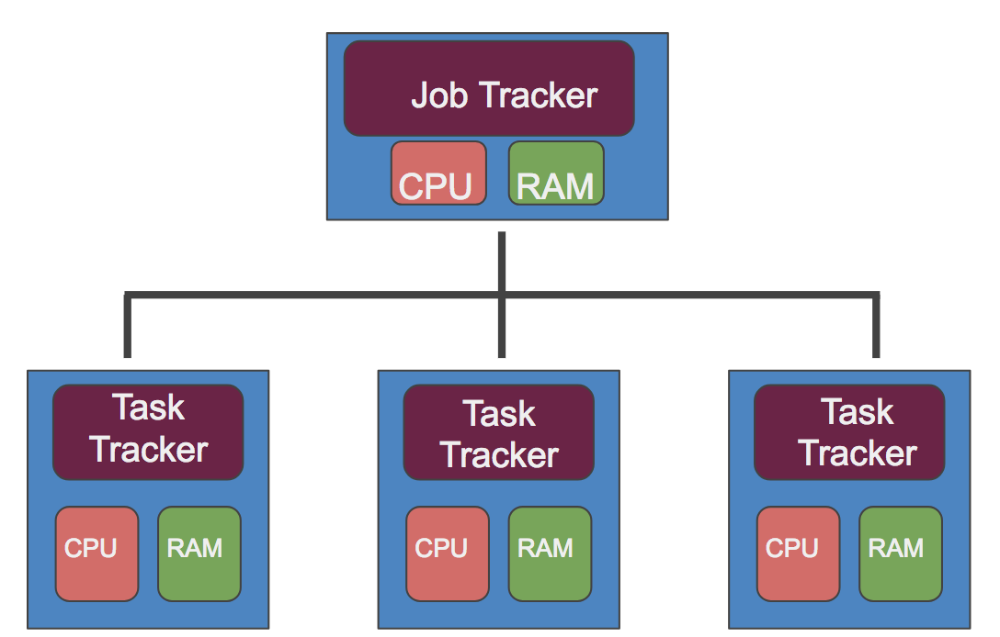
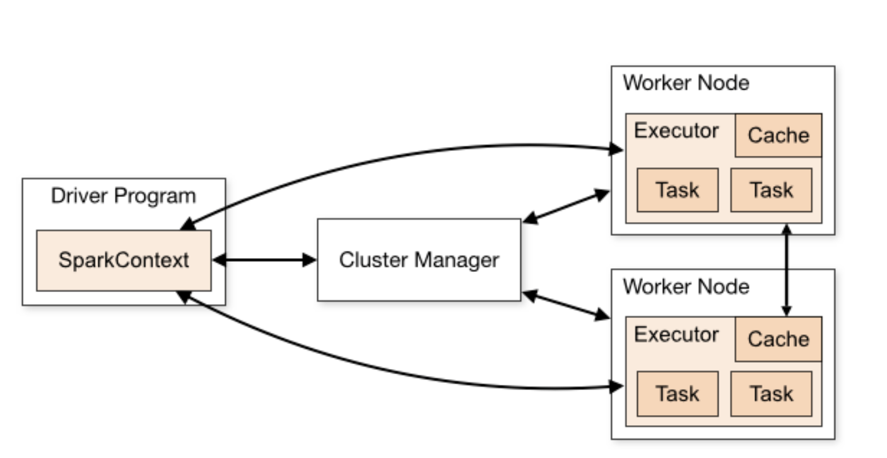
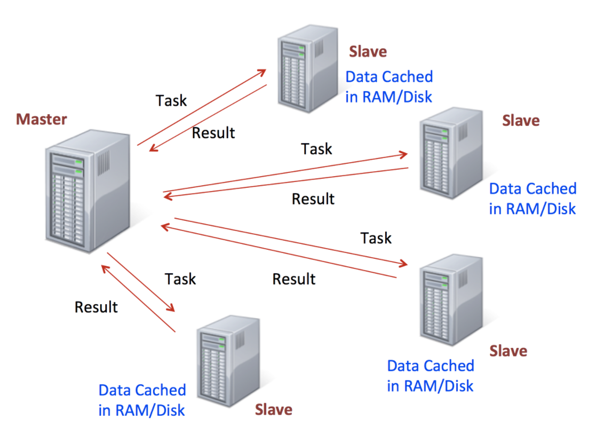

# Spark overview

## Big Data Overview

* What is “Big Data”?
* Explanation of Hadoop, MapReduce,and Spark
* Local versus Distributed Systems
* Overview of Hadoop Ecosystem
* Overview of Spark

## Big Data

* Data that can fit on a local computer, in the scale of 0-32 GB depending on RAM.
* But what can we do if we have a larger set of data?
  * Try using a SQL database to move storage onto hard drive instead of RAM
  * Or use a distributed system, that distributes the data to multiple machines/computer.

* A local process will use the computation resources of a single machine
* A distributed process has access to the computational resources across a number of machines connected through a network
* After a certain point, it is easier to scale out to many lower CPU machines, than to try to scale up to a single machine with a high CPU.
* Distributed machines also have the advantage of easily scaling, you can just add more machines

## Hadoop

* Hadoop is a way to distribute very large files across multiple machines.
* It uses the Hadoop Distributed File System \(HDFS\)
* HDFS allows a user to work with large data sets
* HDFS also duplicates blocks of data for fault tolerance
* It also then uses MapReduce
* MapReduce allows computations on that data

## Distributed Storage - HDFS

* HDFS will use blocks of data, with a size of 128 MB by default
* Each of these blocks is replicated 3 times
* The blocks are distributed in a way to support fault tolerance
* Smaller blocks provide more parallelization during processing
* Multiple copies of a block prevent loss of data due to a failure of a node

## MapReduce

* MapReduce is a way of splitting a computation task to a distributed set of files \(such as HDFS\)
* It consists of a Job Tracker and multiple Task Trackers
* The Job Tracker sends code to run on the Task Trackers
* The Task trackers allocate CPU and memory for the tasks and monitor the tasks on the worker nodes

_**What we covered can be thought of in two distinct parts:**_

* Using HDFS to distribute large data sets
* Using MapReduce to distribute a computational task to a distributed data set

## Spark RDDs

* At the core of Spark is the idea of a Resilient Distributed Dataset \(RDD\)
* Resilient Distributed Dataset \(RDD\) has 4 main features:
  * Distributed Collection of Data
  * Fault-tolerant
  * Parallel operation - partioned
  * Ability to use many data sources

* RDDs are immutable, lazily evaluated, and cacheable
* There are two types of Spark operations:
  * Transformations
  * Actions
* Transformations are basically a recipe to follow.
* Actions actually perform what the recipe says to do and returns something back
* This behaviour carries over to the syntax when coding.
* A lot of times you will write a method call, but won’t see anything as a result until you call the action.
* This makes sense because with a large dataset, you don’t want to calculate all the transformations until you are sure you want to perform them!

